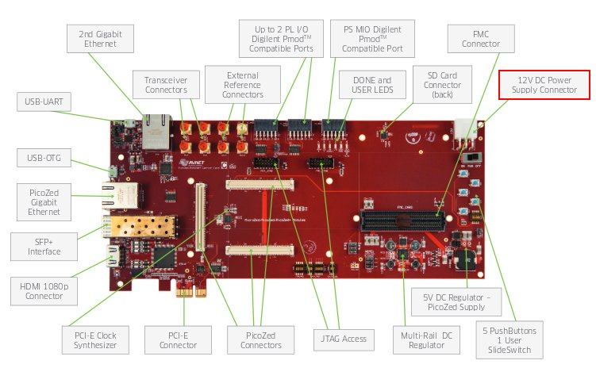

Power-On
========

@board@ takes the power from the connector *J14*. The board is shipped with an external power adapter.

On connector *J6* you can have the serial console, so, during your daily development use,
you would just connect your workstation to the board using the micro-USB.
