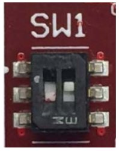

Make sure that @board@ boot mode SW switches are set like in the following picture:

Insert the SD card you just prepared inside socket **J2**.

Connect the micro-USB cable from your PC to @board@ connector **J6**.

And now proceed by setting up the serial console.

.. include:: serial_console.rst

.. warning::

 The next procedure changes the boot mode of the u-boot. This step is necessary in order to use the files built by Yocto but could make not usable others sd-card built with other SDK.

Before starting to work with the SD-Card built by SDK, it is necessary modify u-boot environment variables.
Turn on the board and before the countdown ends press *Enter* key. Will be shown the u-boot prompt, then insert the following commands:

.. board::

	| zynq-uboot> setenv modeboot "run uenvboot"
	| zynq-uboot> setenv uenvboot "fatload mmc 0 0x3000000 uEnv.txt && env import -t 0x3000000 $filesize && run uenv_boot"
	| zynq-uboot> saveenv
	
| Then reboot the board.
|
| Give *root* to the login prompt:

.. board::

 | @machine-name@ login: root

and press *Enter*.

.. note::

 Sometimes, the time you spend setting up minicom makes you miss all the output that leads to the login and you see just a black screen, press *Enter* then to get the login prompt.
