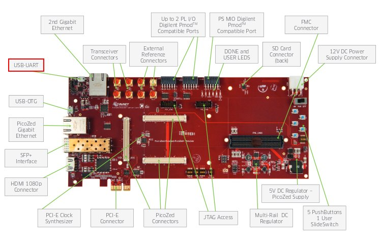

On @board@ the USB-UART port is used for serial console.

which you can connect, by means of a micro-USB cable, to your personal computer.

.. note::

 Every operating system has its own killer application to give you a serial terminal interface. In this guide, we are assuming your **host** operating system is **Ubuntu**.

On a Linux (Ubuntu) host machine, the console is seen as a ttyACMX device and you can access to it by means
of an application like *minicom*.

*Minicom* needs to know the name of the serial device. The simplest way for you to discover
the name of the device is by looking to the kernel messages, so:

1. clean the kernel messages

.. host::

 | sudo dmesg -c

2. connect the mini-USB cable to the board already powered-on

3. display the kernel messages

.. host::

 | dmesg

3. read the output

.. host::

 | [ 5522.462414] usb 2-1.1: new full-speed USB device number 6 using ehci_hcd
 | [ 5522.557574] cp210x 2-1.1:1.0: cp210x converter detected
 | [ 5522.630151] usb 2-1.1: reset full-speed USB device number 6 using ehci_hcd
 | [ 5522.723501] usb 2-1.1: cp210x converter now attached to @console-device@

As you can see, here the device has been recognized as **@console-device@**.

Now that you know the device name, run *minicom*:

.. host::

 | sudo minicom -ws

If minicom is not installed, you can install it with:

.. host::

 | sudo apt-get install minicom

then you can setup your port with these parameters:

.. host::

 | +-----------------------------------------------------------------------+
 | | A -    Serial Device      : /dev/ttyUSB0                              |
 | | B - Lockfile Location     : /var/lock                                 |
 | | C -   Callin Program      :                                           |
 | | D -  Callout Program      :                                           |
 | | E -    Bps/Par/Bits       : 115200 8N1                                |
 | | F - Hardware Flow Control : No                                        |
 | | G - Software Flow Control : No                                        |
 | |                                                                       |
 | |    Change which setting?                                              |
 | +-----------------------------------------------------------------------+
 |         | Screen and keyboard      |
 |         | Save setup as dfl        |
 |         | Save setup as..          |
 |         | Exit                     |
 |         | Exit from Minicom        |
 |         +--------------------------+

If on your system the device has not been recognized as *@console-device@*, just replace *@console-device@*
with the proper device.

Once you are done configuring the serial port, you are back to *minicom* main menu and you can select *exit*.

